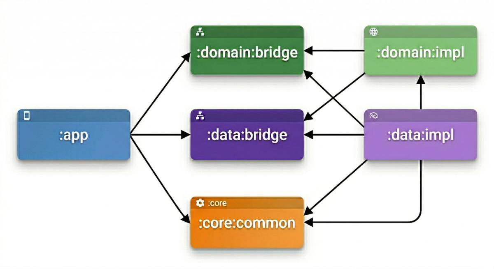

# 🔍 GitHub Popular Search

Aplicativo Android nativo que consome a [GitHub REST API](https://docs.github.com/en/rest) para listar os repositórios mais populares (por estrelas) de uma linguagem de programação selecionada e exibir seus pull requests abertos.

O projeto foi construído com foco em **escalabilidade**, **testabilidade** e **separação de responsabilidades**, aplicando Clean Architecture com MVVM em uma estrutura multi-módulo com split `bridge`/`impl` para eliminar dependências circulares.

---

## 📋 Índice

- [Funcionalidades](#-funcionalidades)
- [Arquitetura](#-arquitetura)
  - [Fluxo de dados](#fluxo-de-dados)
  - [Padrão Bridge / Impl](#padrão-bridge--impl)
  - [Diagrama de dependências](#diagrama-de-dependências)
- [Stack tecnológica](#-stack-tecnológica)
- [Pré-requisitos](#-pré-requisitos)
- [Como rodar localmente](#-como-rodar-localmente)
- [Comandos úteis](#-comandos-úteis)
- [Testes](#-testes)
- [Qualidade de código](#-qualidade-de-código)
- [CI/CD com Fastlane](#-cicd-com-fastlane)

---

## ✨ Funcionalidades

| Feature | Descrição |
|---|---|
| **Listagem de repositórios** | Busca paginada dos repositórios mais estrelados por linguagem via GitHub Search API, com scroll infinito. |
| **Seleção de linguagem** | Dropdown com 24 linguagens (Kotlin, Swift, Python, Rust, Go, etc.) para filtro dinâmico. |
| **Pull requests** | Ao clicar em um repositório, exibe a lista paginada de pull requests abertos. |
| **Offline-first** | Cache local com Room — se a rede falhar durante um refresh, dados cacheados são exibidos automaticamente. |
| **Pull-to-refresh** | Suporte nativo a Material 3 `PullToRefreshBox` em ambas as telas. |
| **Tratamento de erros** | Mapeamento centralizado de exceções (`ErrorMapper`) com feedback visual por tipo de erro (rede, timeout, servidor, parsing). |
| **Deep link / navegação type-safe** | Rotas serializáveis com `@Serializable` — sem encoding/decoding manual de URLs. |
| **Process death recovery** | Estado de navegação e filtros preservados via `SavedStateHandle`. |

---

## 🏗 Arquitetura

### Visão geral dos módulos

O projeto segue **Clean Architecture** com a separação em camadas, organizada em módulos Gradle independentes:

| Módulo | Responsabilidade | Plugin Gradle |
|---|---|---|
| `:app` | UI (Jetpack Compose), Navigation, ViewModels, Mappers UI, entry point Hilt | `githubpopular.android.application` |
| `:domain:bridge` | Interfaces de Use Cases, interfaces de Repositories, entidades de domínio | `githubpopular.jvm.library` |
| `:domain:impl` | Implementações concretas dos Use Cases + Hilt bindings | `githubpopular.jvm.library` |
| `:data:bridge` | Definições de entidades Room (`@Entity`), modelos remotos (`@Serializable`), Remote Keys | `githubpopular.android.library` |
| `:data:impl` | Retrofit Services, Room Database/DAOs, Repository implementations, RemoteMediators, Mappers, Hilt bindings | `githubpopular.android.library` |
| `:core:common` | Configuração de rede (`NetworkModule`), error handling centralizado, extensões utilitárias | `githubpopular.android.library` |
| `build-logic/convention` | Convention plugins compartilhados (compileSdk, minSdk, JVM target, JaCoCo) | — |

### Fluxo de dados

#### Repositórios

```
MainScreen (Compose)
  └→ GetRepositoriesViewModel
       ├─ selectedLanguage: SavedStateHandle-backed StateFlow<String?>
       └─ repositories: filterNotNull() → flatMapLatest → cachedIn(viewModelScope)
            └→ GetRepositoriesUseCase (domain:bridge interface)
                 └→ GetRepositoriesUseCaseImpl (domain:impl)
                      └→ GitHubReposRepository (domain:bridge interface)
                           └→ GitHubReposRepositoryImpl (data:impl)
                                ├─ Pager(config, remoteMediator, pagingSourceFactory)
                                ├─ PagingSource ← Room (GitHubRepositoriesDao)
                                └─ RemoteMediator → Retrofit (GitHubRepositoriesService)
                                     └→ GitHub API: GET /search/repositories?q=language:{lang}&sort=stars&page={n}
```

#### Pull Requests

```
PullRequestsScreen (Compose)
  └→ GetPullRequestsViewModel
       ├─ requestState: MutableStateFlow<PullRequestsRequest?>
       └─ pullRequests: filterNotNull() → flatMapLatest → cachedIn(viewModelScope)
            └→ GetPullRequestsUseCase → GitHubPullRequestsRepositoryImpl
                 ├─ PagingSource ← Room (GitHubPullRequestsDao)
                 └─ RemoteMediator → Retrofit (GitHubPullRequestsService)
                      └→ GitHub API: GET {pulls_url}?page={n}
```

**Estratégia offline-first:** Ambos os `RemoteMediator` implementam fallback para cache — quando um `REFRESH` falha e existem dados em cache no Room, o mediator retorna `MediatorResult.Success` em vez de propagar o erro. Falhas em `APPEND` (paginação) são sempre propagadas.

### Padrão Bridge / Impl

O split `bridge`/`impl` é a estratégia para **desacoplar contratos de implementações**:

- **`bridge`** — contém apenas interfaces e data classes (contratos públicos). Módulos que precisam de um contrato dependem apenas do `bridge`.
- **`impl`** — contém as implementações concretas + bindings Hilt. Somente o `:app` (e módulos de teste) dependem dos `impl`.

Isso evita dependências circulares e permite que, por exemplo, `:domain:bridge` não precise conhecer Room ou Retrofit.

### Diagrama de dependências



## 🛠 Stack tecnológica

### Core

| Tecnologia | Versão | Uso |
|---|---|---|
| **Kotlin** | 2.3.20 | Linguagem principal |
| **AGP (Android Gradle Plugin)** | 9.1.0 | Build system |
| **Compile SDK / Target SDK** | 36 | API level |
| **Min SDK** | 23 | Android 6.0+ |
| **JVM Target** | 21 | Java toolchain |

### UI

| Biblioteca | Uso |
|---|---|
| **Jetpack Compose** | Toolkit declarativo de UI |
| **Material 3** | Design system (TopAppBar, Cards, PullToRefreshBox, ExposedDropdownMenu) |
| **Navigation Compose** | Navegação type-safe com rotas `@Serializable` |
| **Coil** | Carregamento assíncrono de imagens (avatares) |
| **Lifecycle Runtime Compose** | `collectAsStateWithLifecycle` para observação lifecycle-aware |

### Networking

| Biblioteca | Uso |
|---|---|
| **Retrofit** | Cliente HTTP type-safe para a GitHub API |
| **OkHttp** | HTTP client com logging interceptor (apenas em debug) |
| **kotlinx.serialization** | Serialização/deserialização JSON (substituindo Gson/Moshi) |

### Persistência

| Biblioteca | Uso |
|---|---|
| **Room** | Banco de dados SQLite com type-safety em compile time |
| **Room Paging** | Integração Room + Paging 3 para `PagingSource` direto do banco |

### Paginação

| Biblioteca | Uso |
|---|---|
| **Paging 3** | Scroll infinito com `RemoteMediator` (network + cache), `Pager`, `LazyPagingItems` |

### Injeção de dependência

| Biblioteca | Uso |
|---|---|
| **Hilt** | DI com geração de código em compile time via KSP |
| **Hilt Navigation Compose** | `hiltViewModel()` scoped à nav destination |

### Qualidade & Tooling

| Ferramenta | Uso |
|---|---|
| **Spotless** + **ktlint** | Formatação automática de código Kotlin |
| **Detekt** | Análise estática de código com regras customizadas (`detekt.yml`) |
| **JaCoCo** | Cobertura de testes com threshold mínimo de **90%** |
| **LeakCanary** | Detecção de memory leaks em debug builds |
| **Timber** | Logging estruturado (plantado apenas em debug) |
| **KSP** | Processamento de anotações (Room, Hilt, Glide) |
| **Dependency Analysis** | Análise de dependências não utilizadas/mal configuradas |
| **Pre-commit hook** | Git hook automático que roda `spotlessCheck` + `detekt` antes de cada commit |

### Testes

| Biblioteca | Uso |
|---|---|
| **JUnit 4** | Framework de testes unitários |
| **MockK** | Mocking framework idiomático para Kotlin |
| **kotlinx-coroutines-test** | `UnconfinedTestDispatcher`, `runTest` para testar coroutines |
| **Paging Testing** | Utilitários para testar flows de `PagingData` |
| **Robolectric** | Testes unitários que necessitam de Android framework |

### CI/CD

| Ferramenta | Uso |
|---|---|
| **Fastlane** | Automação de build, testes, coverage e deploy |
| **build-logic/convention** | Convention plugins para padronização de build entre módulos |

---

## 📌 Pré-requisitos

| Requisito | Versão mínima                                                 |
|---|---------------------------------------------------------------|
| **Android Studio** | Panda 2 (2025.3.2) ou superior                                |
| **JDK** | 21 (o projeto configura via Gradle Toolchain automaticamente) |
| **Gradle** | Wrapper incluído — não precisa instalar separadamente         |
| **Ruby + Bundler** | Necessário apenas para comandos Fastlane                      |

> ⚠️ **O projeto usa a GitHub REST API pública** (sem autenticação). O rate limit é de **10 requests/minuto** para usuários não autenticados. Se você quiser aumentar esse limite, configure um [Personal Access Token](https://docs.github.com/en/authentication/keeping-your-account-and-data-secure/managing-your-personal-access-tokens).

---

## 🚀 Como rodar localmente

### 1. Clone o repositório

```bash
git clone https://github.com/caio-luis/Git-Hub-Popular-Search.git
cd Git-Hub-Popular-Search
```

### 2. Abra no Android Studio

- **File → Open** → selecione o diretório raiz do projeto.
- Aguarde o Gradle sync finalizar (pode levar alguns minutos na primeira vez).

### 3. Rode o app

- Selecione um emulador ou dispositivo físico com **API 23+**.
- Clique em **Run ▶️** ou use o atalho `Shift + F10`.

### Via linha de comando

```bash
# Build de todos os variants
./gradlew assemble

# Instalar debug no dispositivo conectado
./gradlew installDebug
```

---

## 🔧 Comandos úteis

| Comando | Descrição |
|---|---|
| `./gradlew assemble` | Build de todos os variants |
| `./gradlew test` | Roda todos os testes unitários |
| `./gradlew :app:test` | Roda apenas os testes do módulo `:app` |
| `./gradlew spotlessCheck` | Verifica formatação do código |
| `./gradlew spotlessApply` | Aplica formatação automática |
| `./gradlew detekt` | Roda análise estática |
| `./gradlew jacocoTestReport` | Gera relatório de cobertura de testes |
| `./gradlew jacocoTestCoverageVerification` | Verifica threshold mínimo de cobertura (90%) |
| `./gradlew installGitHooks` | Instala pre-commit hook (spotless + detekt) |
| `./gradlew clean` | Limpa build (também instala git hooks automaticamente) |

---

## 🧪 Testes

Os testes ficam em `src/test/` de cada módulo, totalizando **29 classes** distribuídas por todas as camadas:

| Módulo | Categorias cobertas |
|---|---|
| `:app` | ViewModels, Mappers UI, Navigation, UI Compose |
| `:data:impl` | DAOs, Local/Remote Sources, RemoteMediators, Repositories, Mappers |
| `:domain:impl` | Use Cases |
| `:core:common` | Error Handling, Extensions |

### Padrões adotados

- **ViewModels**: `MainDispatcherRule` com `UnconfinedTestDispatcher`.
- **RemoteMediators**: mock de `withTransaction` e DAOs diretamente, sem instrumentação.
- **UI (Compose)**: Robolectric + `createComposeRule`, cobrindo estados de `LoadState` (itens, vazio, fim de lista, erro).
- **Fixtures**: dados compartilhados em `fixtures/` para reutilização entre testes.
- **Cobertura**: JaCoCo com threshold mínimo de **90%**.

### Rodar testes

```bash
# Todos os testes
./gradlew test

# Módulo específico
./gradlew :app:test
./gradlew :data:impl:test
./gradlew :domain:impl:test
./gradlew :core:common:test

# Com relatório de cobertura
./gradlew jacocoTestReport
# Relatório HTML: {module}/build/reports/jacoco/jacocoTestReport/html/index.html
```

---

## 🔒 Qualidade de código

### Spotless + ktlint

Formatação automática aplicada a todos os submódulos. Composable functions são excluídas da regra de naming.

### Detekt

Análise estática com regras customizadas em [`detekt.yml`](detekt.yml):

- `LongParameterList` → threshold 8 (funções), 10 (construtores), ignora `@Composable`
- `CyclomaticComplexMethod` → threshold 15
- `MaxLineLength` → 140 caracteres
- `MagicNumber` → desabilitado
- `WildcardImport` → habilitado
- `UnsafeCallOnNullableType` → habilitado

### Pre-commit hook

Instalado automaticamente via `./gradlew clean` ou `./gradlew installGitHooks`. Executa `spotlessCheck` e `detekt` antes de cada commit — se falhar, o commit é bloqueado.

---

## 🚢 CI/CD com Fastlane

### Configuração local

O Fastlane é gerenciado via **Bundler** para garantir versões consistentes. Siga os passos abaixo para rodar localmente:

#### 1. Instale o Ruby (caso não tenha)

Recomenda-se usar um gerenciador de versões como o [rbenv](https://github.com/rbenv/rbenv):

```bash
# macOS (Homebrew)
brew install rbenv
rbenv install 3.2.2
rbenv global 3.2.2

# Linux (via rbenv-installer)
curl -fsSL https://github.com/rbenv/rbenv-installer/raw/HEAD/bin/rbenv-installer | bash
rbenv install 3.2.2
rbenv global 3.2.2
```

> Verifique com `ruby --version` se a versão está correta antes de continuar.

#### 2. Instale o Bundler

```bash
gem install bundler
```

#### 3. Instale as dependências do projeto (na raiz do repositório)

```bash
bundle install
```

Isso instalará o Fastlane e todos os plugins declarados no `Gemfile`, de forma isolada do Ruby do sistema.

#### 4. Execute as lanes

```bash
# Lanes disponíveis
bundle exec fastlane android lint       # spotlessCheck + detekt
bundle exec fastlane android test       # todos os testes
bundle exec fastlane android coverage   # verificação de cobertura JaCoCo
bundle exec fastlane android assemble   # build de todos os variants
bundle exec fastlane android ci         # lint → test → coverage → assemble (pipeline completo)
bundle exec fastlane android beta       # build release + Crashlytics Beta
bundle exec fastlane android deploy     # build release + upload Play Store
```

> **Dica:** sempre use `bundle exec fastlane` (e não `fastlane` diretamente) para garantir que a versão correta definida no `Gemfile.lock` seja utilizada.

---

## 📝 Decisões técnicas relevantes

| Decisão | Motivação |
|---|---|
| **Multi-módulo com bridge/impl** | Elimina dependências circulares, acelera builds incrementais, facilita substituição de implementações. |
| **`RemoteMediator` + Room como single source of truth** | Estratégia offline-first recomendada pelo Google — dados sempre vêm do Room, mediator sincroniza com a rede. |
| **Mappers como interfaces injetadas** | Testabilidade: podem ser mockados independentemente. Consistência: mesmo padrão em todas as camadas. |
| **`SavedStateHandle` para estados reativos** | Sobrevive a process death. `StateFlow` derivado via `getStateFlow()` emite automaticamente ao salvar novo valor. |
| **`@Serializable` navigation routes** | Type-safety em compile time. Sem parsing manual de strings/URIs. |
| **Convention plugins em `build-logic`** | Configuração DRY — compileSdk, minSdk, JVM target, JaCoCo definidos uma vez e compartilhados entre todos os módulos. |
| **Spotless + Detekt + pre-commit hook** | Qualidade garantida antes do código chegar ao repositório remoto. |
| **JaCoCo com threshold de 90%** | Força manutenção de alta cobertura de testes em todo código de negócio. |
| **`kotlinx.serialization` ao invés de Gson/Moshi** | Performance superior, integração nativa com Kotlin, suporte a Compose Navigation e Retrofit converter. |

---

## 📄 Licença

Este projeto é open source e pode ser utilizado como referência.
